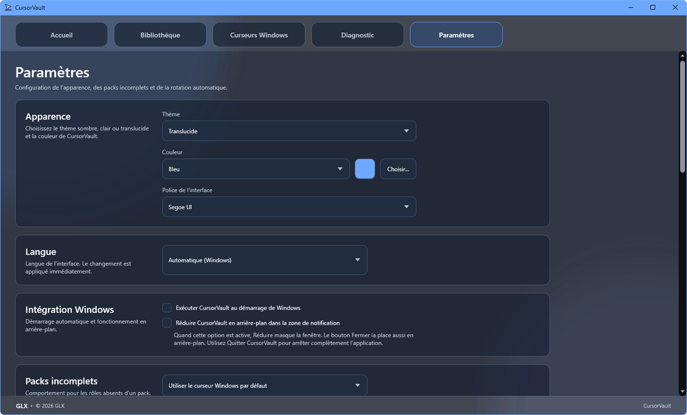

# CursorVault

<div align="center">

### Gestionnaire moderne de curseurs pour Windows

Centralisez, importez, appliquez, sauvegardez et organisez vos packs de curseurs depuis une seule application.

[](https://github.com/GaLeX-Le-Penguin/CursorVault/releases/latest)
[](https://github.com/GaLeX-Le-Penguin/CursorVault/releases)


### [⬇️ Télécharger CursorVault](https://github.com/GaLeX-Le-Penguin/CursorVault/releases/latest)

[Dernière version](https://github.com/GaLeX-Le-Penguin/CursorVault/releases/latest) ·
[Releases](https://github.com/GaLeX-Le-Penguin/CursorVault/releases) ·
[Signaler un problème](https://github.com/GaLeX-Le-Penguin/CursorVault/issues)

</div>

---

## À propos

**CursorVault** est une application Windows développée par **GLX** permettant de centraliser et gérer facilement ses curseurs Windows.

Elle permet d'importer des fichiers `.cur` et `.ani`, d'organiser des packs complets, d'appliquer rapidement un nouveau thème de curseurs et de gérer les schémas déjà présents dans Windows.

L'objectif est simple : proposer une alternative moderne et pratique à la configuration manuelle des curseurs depuis le Panneau de configuration Windows.

---

## Aperçu

### Accueil


### Bibliothèque et paramètres

<p align="center">
  
  
</p>

### Curseurs Windows


> Si tes captures ne portent pas exactement ces noms, remplace simplement `home.png`, `library.png`, `settings.png` et `windows.png` par leurs vrais noms.

---

## Fonctionnalités

### 📚 Bibliothèque de curseurs

- Bibliothèque locale de packs.
- Favoris.
- Recherche par nom, créateur et description.
- Filtres pour les packs complets, incomplets, animés, statiques et favoris.
- Tri par favoris, nom, créateur, complétude ou date d'ajout.
- Détection des variantes Light / Dark.
- Sélection aléatoire d'un pack.
- Affichage du créateur original.

### 📥 Importation

- Import de dossiers.
- Import d'archives ZIP.
- Import de fichiers `.cur`.
- Import de fichiers `.ani`.
- Glisser-déposer directement dans CursorVault.
- Installation locale automatique.
- Détection des doublons.
- Export d'un pack en ZIP.

### 🛠️ Création et analyse

- Créateur de packs intégré.
- Renommage des packs.
- Conservation du crédit du créateur original.
- Analyse des rôles Windows disponibles.
- Détection des fichiers manquants.
- Détection des fichiers invalides.
- Détection des doublons.
- Validation des fichiers CUR et ANI.
- Réparation des références cassées.
- Génération d'un fichier `install.inf`.

### 🖱️ Intégration Windows

- Application automatique d'un pack complet.
- Gestion des 17 rôles de curseurs Windows pris en charge.
- Affichage des schémas déjà installés dans Windows.
- Détection du schéma actuellement actif.
- Application directe d'un schéma Windows.
- Accès aux paramètres de pointeurs Windows.
- Accès au dossier système des curseurs.
- Synchronisation possible avec le thème clair / sombre de Windows.

### ⭐ Automatisation

- Rotation automatique des packs.
- Rotation au démarrage.
- Rotation horaire.
- Rotation quotidienne.
- Rotation limitée aux favoris.
- Démarrage avec Windows.
- Réduction dans la zone de notification.

### 💾 Sauvegarde

- Sauvegarde du schéma Windows actuel.
- Sauvegarde complète au format `.cvb`.
- Restauration des paramètres.
- Restauration des packs.
- Restauration des favoris.
- Mode portable.
- Gestion de l'espace de stockage.
- Nettoyage du cache.

### 🎨 Personnalisation

- Thème sombre.
- Thème clair.
- Thème translucide.
- Couleur personnalisable.
- Choix de la police parmi celles installées dans Windows.
- Interface compacte, normale ou grande.
- Réinitialisation des paramètres.

### 🌍 Langues

CursorVault peut automatiquement utiliser la langue de Windows.

Langues disponibles :

- Français
- English
- Español
- Deutsch
- Italiano

Une langue peut également être sélectionnée manuellement dans les paramètres.

### 🔍 Diagnostic

- Page Diagnostic intégrée.
- Informations système.
- Informations sur la configuration CursorVault.
- Copie du diagnostic dans le presse-papiers.
- Informations de stockage.
- Nettoyage du cache.

---

## Installation

1. Rendez-vous sur la [dernière version de CursorVault](https://github.com/GaLeX-Le-Penguin/CursorVault/releases/latest).
2. Téléchargez **`CursorVault.zip`**.
3. Extrayez complètement l'archive.
4. Lancez **`CursorVault.exe`**.

La structure extraite doit ressembler à :

```text
CursorVault/
├── CursorVault.exe
└── CursorVault_Data/
