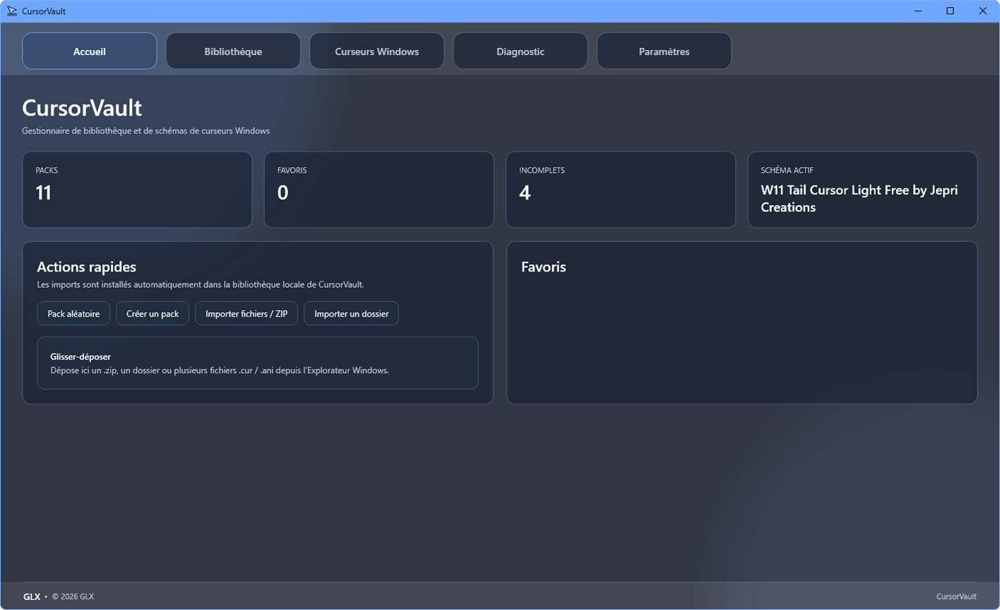
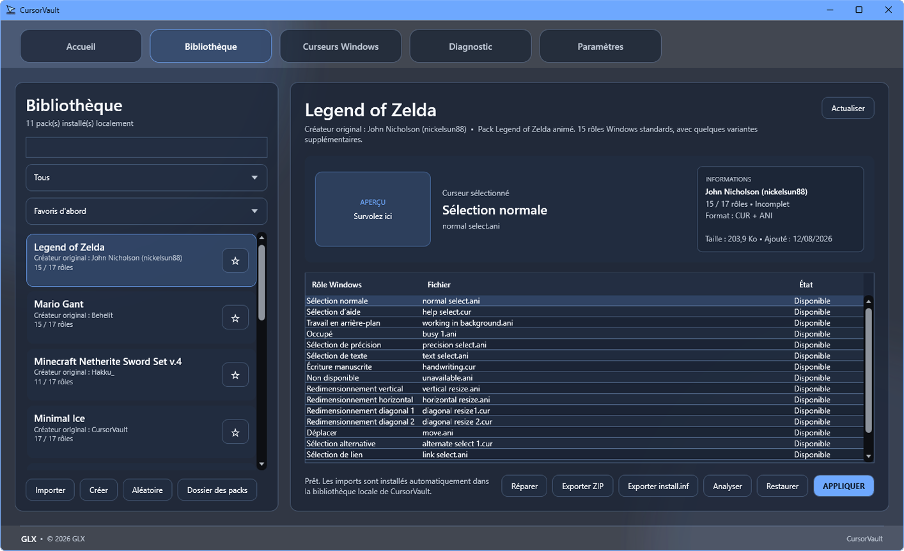
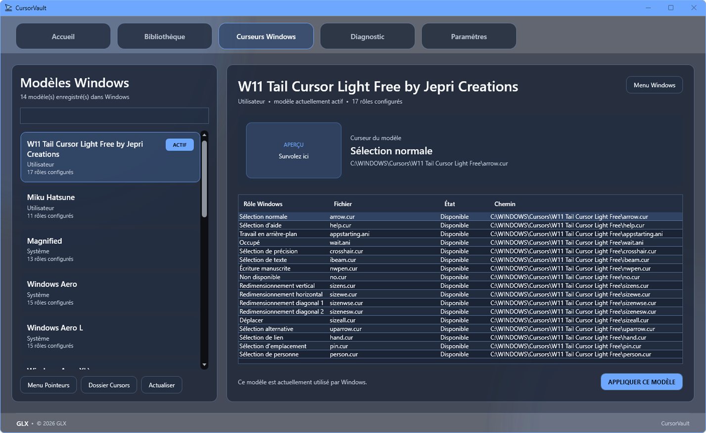
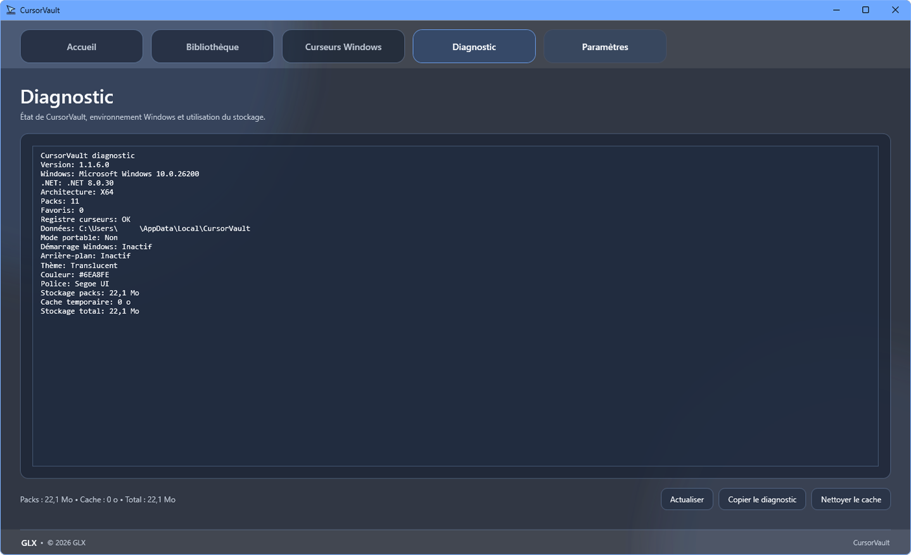

# CursorVault

<div align="center">

[🇫🇷 Français](README.md) · [🇬🇧 English](README_EN.md) · [🇪🇸 Español](README_ES.md) · [🇩🇪 Deutsch](README_DE.md) · 🇮🇹 **Italiano**

### Gestore moderno di cursori per Windows

Centralizza, importa, applica, salva e organizza i tuoi pacchetti di cursori da un'unica applicazione.

[](https://github.com/GaLeX-Le-Penguin/CursorVault/releases/latest)
[](https://github.com/GaLeX-Le-Penguin/CursorVault/releases)


### [⬇️ Scarica CursorVault](https://github.com/GaLeX-Le-Penguin/CursorVault/releases/latest)

[Ultima versione](https://github.com/GaLeX-Le-Penguin/CursorVault/releases/latest) ·
[Release](https://github.com/GaLeX-Le-Penguin/CursorVault/releases) ·
[Segnala un problema](https://github.com/GaLeX-Le-Penguin/CursorVault/issues)

</div>

---

## Informazioni

**CursorVault** è un'applicazione Windows sviluppata da **GLX** per centralizzare e gestire facilmente i cursori di Windows.

Permette di importare file `.cur` e `.ani`, organizzare pacchetti completi, applicare rapidamente un nuovo tema di cursori e gestire gli schemi già presenti in Windows.

L'obiettivo è semplice: offrire un'alternativa moderna e pratica alla configurazione manuale dei cursori tramite il Pannello di controllo di Windows.

---

## Anteprima

### Home



### Libreria



### Cursori Windows



### Diagnostica



### Impostazioni


---

## Funzionalità

### 📚 Libreria cursori

- Libreria locale dei pacchetti
- Preferiti
- Ricerca per nome, creatore e descrizione
- Filtri per pacchetti completi, incompleti, animati, statici e preferiti
- Ordinamento per preferiti, nome, creatore, completezza o data di aggiunta
- Rilevamento delle varianti Light / Dark
- Selezione casuale di un pacchetto
- Visualizzazione del creatore originale

### 📥 Importazione

- Importazione di cartelle
- Importazione di archivi ZIP
- Importazione di file `.cur`
- Importazione di file `.ani`
- Drag & drop direttamente in CursorVault
- Installazione locale automatica
- Rilevamento dei duplicati
- Esportazione di un pacchetto in ZIP

### 🛠️ Creazione e analisi

- Creatore di pacchetti integrato
- Rinomina dei pacchetti
- Conservazione del credito del creatore originale
- Analisi dei ruoli cursore Windows disponibili
- Rilevamento dei file mancanti
- Rilevamento dei file non validi
- Rilevamento dei duplicati
- Validazione CUR e ANI
- Riparazione dei riferimenti interrotti
- Generazione di `install.inf`

### 🖱️ Integrazione Windows

- Applicazione automatica dei pacchetti completi
- Gestione dei ruoli cursore di Windows
- Visualizzazione degli schemi già installati
- Rilevamento dello schema attivo
- Applicazione diretta degli schemi Windows
- Accesso alle impostazioni dei puntatori
- Accesso alla cartella di sistema dei cursori
- Sincronizzazione opzionale con il tema chiaro / scuro di Windows

### ⭐ Automazione

- Rotazione automatica dei pacchetti
- Rotazione all'avvio
- Rotazione oraria
- Rotazione giornaliera
- Rotazione limitata ai preferiti
- Avvio con Windows
- Riduzione nell'area di notifica

### 💾 Backup

- Backup dello schema cursori Windows corrente
- Backup completo in formato `.cvb`
- Ripristino delle impostazioni
- Ripristino dei pacchetti
- Ripristino dei preferiti
- Modalità portatile
- Gestione dello spazio di archiviazione
- Pulizia della cache

### 🎨 Personalizzazione

- Tema scuro
- Tema chiaro
- Colore personalizzabile
- Scelta dei font installati in Windows
- Interfaccia compatta, normale o grande
- Ripristino delle impostazioni

### 🌍 Lingue

CursorVault può utilizzare automaticamente la lingua di Windows.

Lingue disponibili:

- Français
- English
- Español
- Deutsch
- Italiano

È inoltre possibile selezionare manualmente una lingua nelle impostazioni.

### 🔍 Diagnostica

- Pagina Diagnostica integrata
- Informazioni di sistema
- Informazioni sulla configurazione di CursorVault
- Copia della diagnostica negli appunti
- Informazioni sullo spazio di archiviazione
- Pulizia della cache

---

## Installazione

1. Apri l'[ultima versione di CursorVault](https://github.com/GaLeX-Le-Penguin/CursorVault/releases/latest)
2. Scarica **`CursorVault.zip`**
3. Estrai completamente l'archivio
4. Avvia **`CursorVault.exe`**

```text
CursorVault/
├── CursorVault.exe
└── CursorVault_Data/
```

La versione ufficiale non richiede un'installazione separata di .NET.

---

## Requisiti di sistema

- Windows 10 o Windows 11
- Architettura x64
- Nessuna installazione separata di .NET richiesta

---

## Aggiornamenti

CursorVault può verificare automaticamente la disponibilità di nuove versioni tramite **GitHub Releases**.

### [⬇️ Scarica l'ultima versione](https://github.com/GaLeX-Le-Penguin/CursorVault/releases/latest)

---

## Dati utente

CursorVault conserva localmente i dati necessari al funzionamento, inclusi pacchetti importati, preferiti, impostazioni, backup e file di cache.

È disponibile anche una **modalità portatile** per conservare i dati insieme all'applicazione.

---

## Formati supportati

- `.cur`
- `.ani`

I pacchetti vengono analizzati prima dell'applicazione per rilevare file mancanti o non validi.

---

## Crediti

CursorVault può includere o supportare pacchetti di cursori creati da diversi autori.

Il creatore originale di un pacchetto rimane indicato nell'applicazione quando è noto.

I pacchetti di terze parti rimangono di proprietà dei rispettivi autori.

CursorVault e la sua identità visiva sono sviluppati da **GLX**.

---

## Segnala un problema

Hai trovato un bug o vuoi proporre un miglioramento?

Utilizza le [GitHub Issues](https://github.com/GaLeX-Le-Penguin/CursorVault/issues).

Quando possibile, indica la versione di CursorVault, la versione di Windows, i passaggi per riprodurre il problema, il messaggio di errore, uno screenshot e la diagnostica di CursorVault.

---

## Compatibilità

| Sistema | Supporto |
|---|---|
| Windows 11 x64 | ✅ |
| Windows 10 x64 | ✅ |
| Windows ARM | Non testato |
| Linux | ❌ |
| macOS | ❌ |

---

## Copyright

**CursorVault**  
Copyright © 2026 GLX

CursorVault e la sua identità visiva sono sviluppati da **GLX**.

Le creazioni e i pacchetti di cursori di terze parti rimangono di proprietà dei rispettivi autori.

---

<div align="center">

### CursorVault

Sviluppato da **GLX** per Windows.

[⬇️ Scarica](https://github.com/GaLeX-Le-Penguin/CursorVault/releases/latest) ·
[Release](https://github.com/GaLeX-Le-Penguin/CursorVault/releases) ·
[Issues](https://github.com/GaLeX-Le-Penguin/CursorVault/issues)

</div>
